<!-- ═══════════════════════════════════════════════════════ -->
<!--  NEURAL_OS v2077 // OPERATIVE DOSSIER: NINAD AMANE   -->
<!-- ═══════════════════════════════════════════════════════ -->


 

 

<!-- ═══════════════════════ ABOUT ═══════════════════════ -->

 
  

<!-- ═══════════════════ TECH STACK ═══════════════════ -->

 

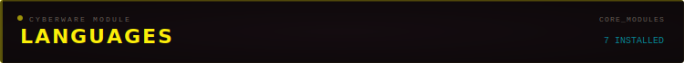
  

  

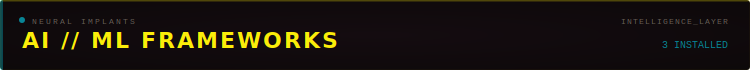
  
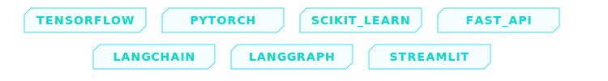

  

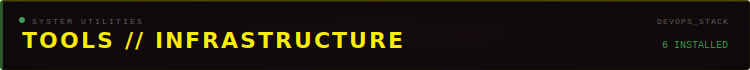
  
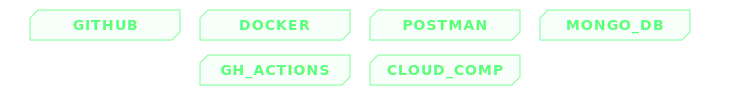

  

<!-- ═══════════════════ PROJECTS ═══════════════════ -->

 

<table>
<tr>
<td width="50%">
<a href="https://github.com/NinadAmane/Ghost-Coder">
</a>
</td>
<td width="50%">
<a href="https://github.com/NinadAmane/Agentic-ICU-Intelligent-Multi-Agent-ICU-Monitoring">
</a>
</td>
</tr>
<tr>
<td width="50%">
<a href="https://github.com/NinadAmane/logs_classification_nlp_project">
</a>
</td>
<td width="50%">
<a href="https://github.com/NinadAmane/Neonatal-Sepsis">
</a>
</td>
</tr>
</table>

 

<!-- ═══════════════════ PUBLICATIONS ═══════════════════ -->

 

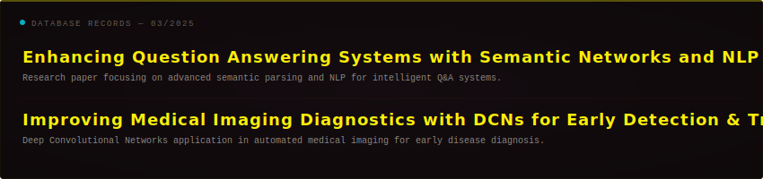

  

<!-- ═══════════════════ STATS ═══════════════════ -->

 

&nbsp;

  

  

<!-- ═══════════════════ ACTIVITY ═══════════════════ -->

 

  

<a href="https://github.com/NinadAmane">
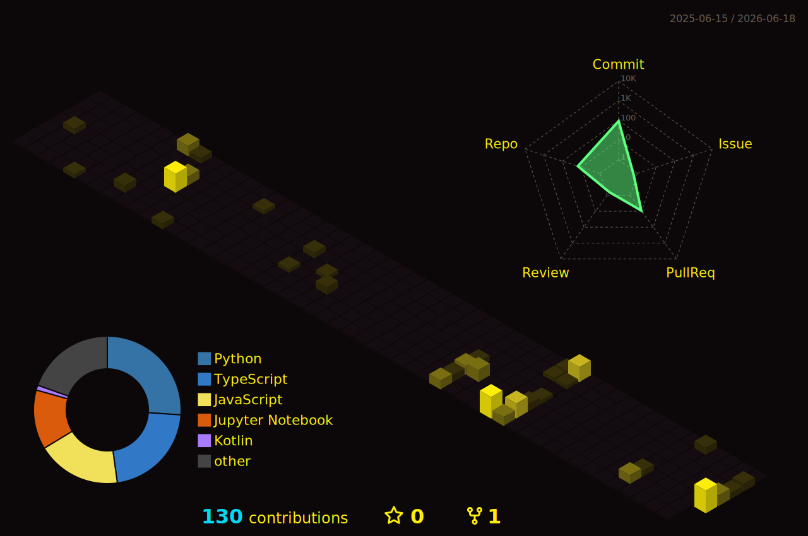
</a>

  

<!-- ═══════════════════ CONNECT ═══════════════════ -->

 

&nbsp;

&nbsp;

&nbsp;

  

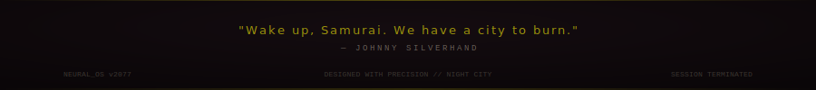

 

 

<!-- NEURAL_OS SESSION TERMINATED -->
